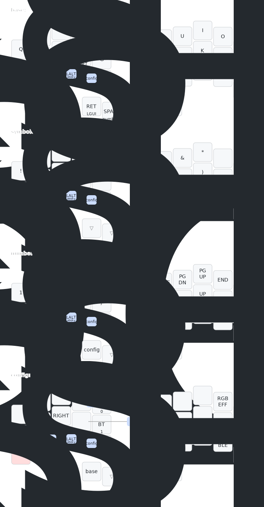

## zmk-config

### Builds
[Firmware builds](https://github.com/dcai/zmk-config/actions)

### `3x5` keyboard keymap(sweep, reviung34 etc)

Generated by @caksoylar's [keymap-drawer](https://github.com/caksoylar/keymap-drawer):

