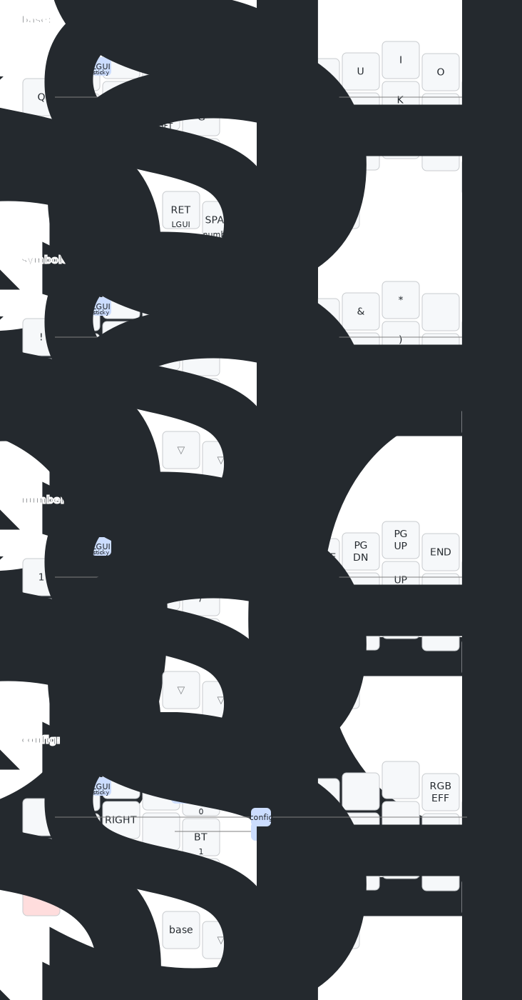

## zmk-config

[Firmware builds](https://github.com/dcai/zmk-config/actions)

[Sweep](https://github.com/davidphilipbarr/Sweep/tree/main/Sweep%20Bling%20MX) keymap:

Generated by @caksoylar's [keymap-drawer](https://github.com/caksoylar/keymap-drawer)

### Other keyboards

- [reviung34](./reviung34.md)
- [reviung5](./reviung5.md)
