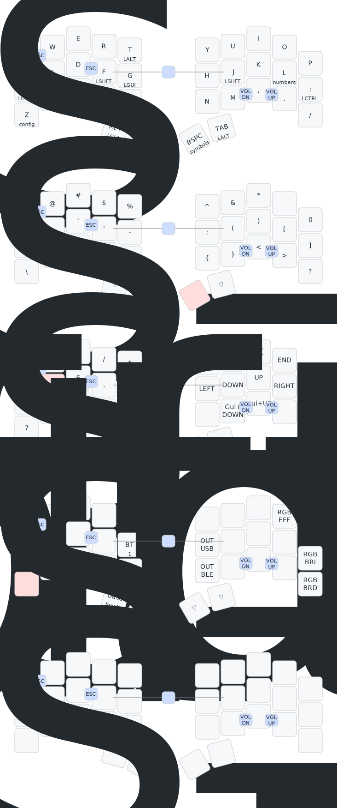

## zmk-config

[Firmware builds](https://github.com/dcai/zmk-config/actions)

[Sweep](https://github.com/davidphilipbarr/Sweep/tree/main/Sweep%20Bling%20MX) keymap:


```
                    == layout and key index ==

 +----+----+----+----+----+            +----+----+----+----+----+
 |  0 |  1 |  2 |  3 |  4 |            |  5 |  6 |  7 |  8 |  9 |
 +----+----+----+----+----+            +----+----+----+----+----+
 | 10 | 11 | 12 | 13 | 14 |            | 15 | 16 | 17 | 18 | 19 |
 +----+----+----+----+----+            +----+----+----+----+----+
 | 20 | 21 | 22 | 23 | 24 |            | 25 | 26 | 27 | 28 | 29 |
 +----+----+----+----+----+----+  +----+----+----+----+----+----+
                     | 30 | 31 |  | 32 | 33 |
                     +----+----+  +----|----+


```



Generated by @caksoylar's [keymap-drawer](https://github.com/caksoylar/keymap-drawer)

### Other keyboards

- [reviung34](./reviung34.md)
- [reviung5](./reviung5.md)
